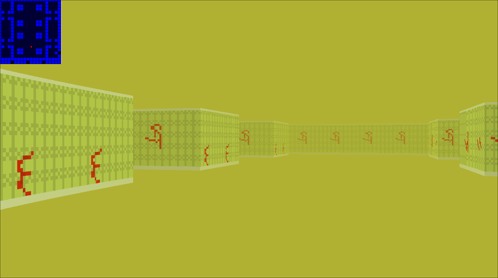

# cub3D

cub3D is a wolfeistein3D-like renderer that use raycasting to render a given map in pseudo 3D

### Prerequisites

The project is only compatible with the Linux operating system

Projects dependancies:
 - make
 - git
 - a C compiler

The Makefile will clone and compile the minilibx-linux library in order to run so make sure to have all the dependancies: https://github.com/42Paris/minilibx-linux 
#
### Installing

In order to compile the project, run:
```
make
```

To support basic Delta Time, run:
```
make bonus
```

You can change parameters like:
 - Window resolution
 - Rays resolution
 - Wall shading

by modifying the relevent parameters inside "./include/cub3D.h"
```c
//APP SETTINGS------------//
# define WIN_W	1600
# define WIN_H	900
# define WIN_N	"cub3D"

# define DEF_VERT_SHADE	0
# define DEF_HOR_SHADE	8
# define RENDER_RES	2
//------------------------//
```
#
### Usage

The controls are:
 - WASD to move
 - LEFT/RIGHT or the mouse to turn the camera
 - ESCAPE to exit the game

To run the project:
```
./cub3D path/to/map
```

A valid map as to:
 - Contain a texture path per wall orientation
 - Contain a  RGB color for the floor and ceilling
 - Contain a description of the map represented by: 1 for walls, 0 for floors, N/S/W/E for the player spawn point and orientation.
 - Be completly closed
 - Have its description after the textures path and colors 

Here is an exemple of a valid map:
```
NO ./assets/backroom-north.xpm
SO ./assets/backroom-south.xpm
WE ./assets/backroom-west.xpm
EA ./assets/backroom-east.xpm

F   176 ,178 ,50
C   176, 177 ,  50

11111111111111111111
10001000000000010001
10001011000011010001
10001011000011010001
11011000000000011011
10000000000000000001
11011000000000011011
10001011000011010001
10001011000011010001
10001000000000010001
10001000000000010001
10001011000011010001
10001011000011010001
11011000000000011011
10000000000000000001
1101100000N000011011
10001011000011010001
1000101100001101001
10001000000000010001
11111111111111111111
1111 1111 1111 11111
```

The "maps" directory already contain exemples of invalid and valid maps. Only test.cub and backroom.cub are valid.
#
### Exemple
<p align="center">
  
</p>
